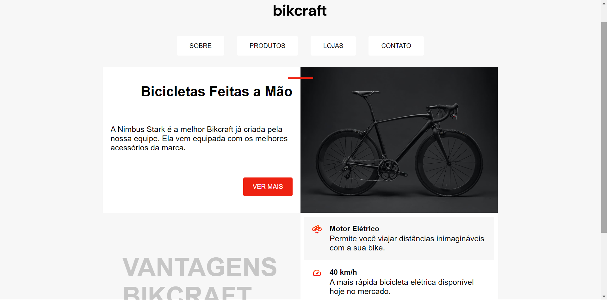

# Bikcraft
Bem-vindo ao meu terceiro projeto, desenvolvido durante o Curso HTML e CSS para Iniciantes da Origamid. Esta iniciativa representa uma aplicação prática dos conceitos fundamentais de HTML5 e CSS3, evidenciando os primeiros passos da minha jornada na construção de páginas web.

<a href="https://eduardzs.github.io/bikcraft/">Link do Projeto</a>

